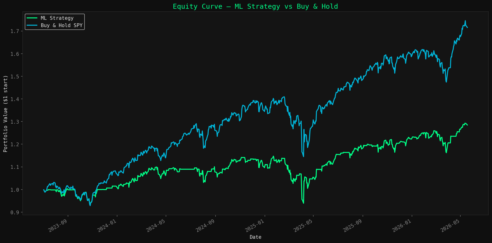
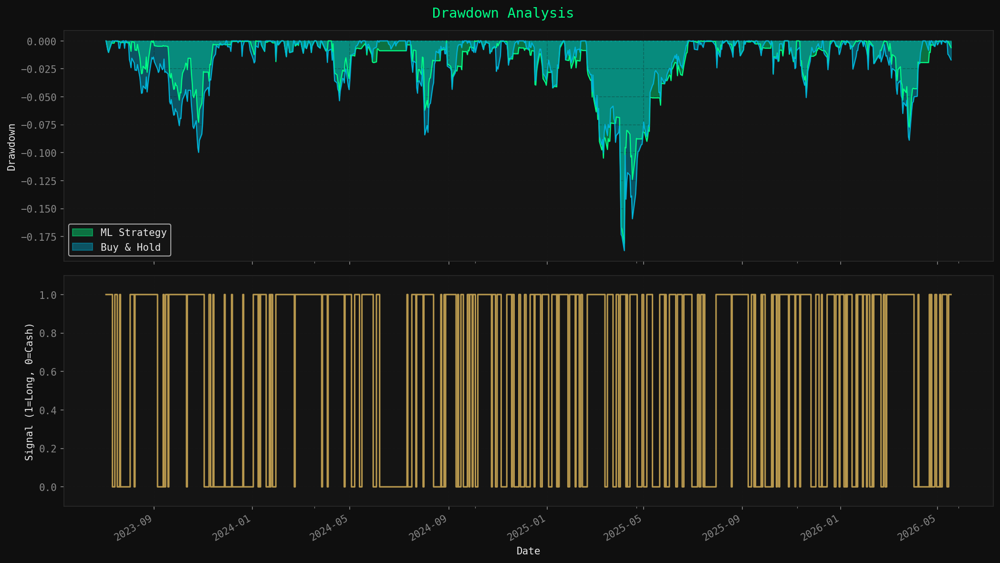
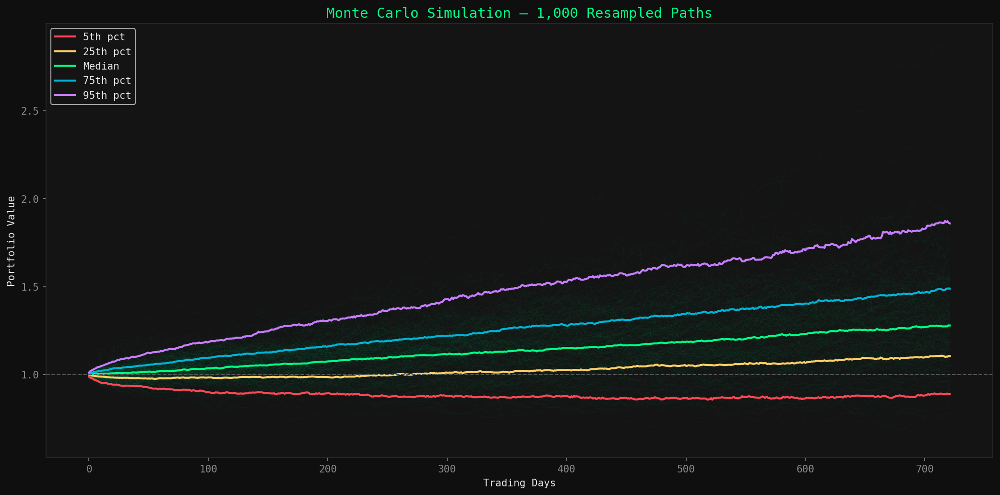
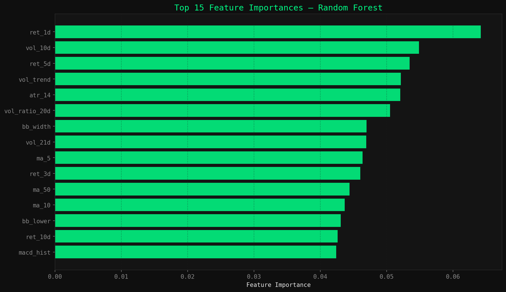
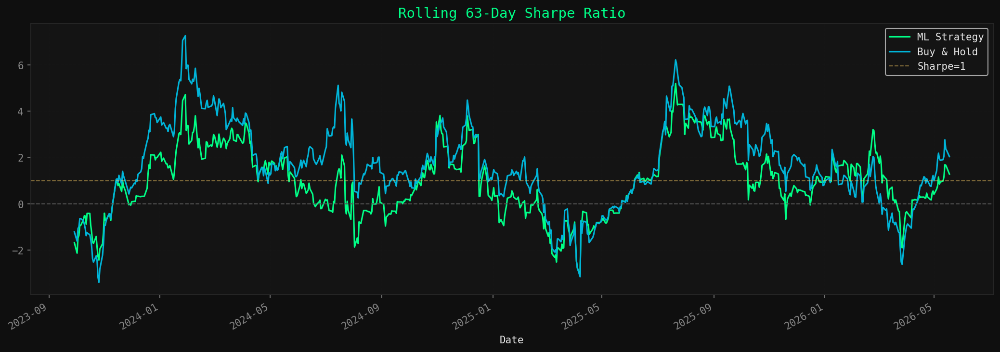

# ML Quantitative Equity Strategy

A machine learning-driven momentum strategy for SPY (S&P 500 ETF) using walk-forward validation, Monte Carlo simulation, and a live signal generator you can actually run each morning before market open.

---

## What This Is

Most backtests are dishonest. They train on all available data, test on the same data, and report results that will never hold in live trading.

This strategy uses **walk-forward validation** — training on an expanding window and testing on the next unseen period — to simulate how the model would have performed if deployed in real time. The result is a more honest picture of out-of-sample performance.

The live signal generator downloads fresh data each morning and tells you whether to be long SPY or in cash for the day.

---

## Strategy Logic

The model predicts whether SPY will close higher or lower the next trading day using 20+ technical features across momentum, volatility, mean-reversion, and volume regimes. A Random Forest classifier outputs a probability; if the probability exceeds 0.55, the strategy goes long. Otherwise it sits in cash.

**Features include:**
- Multi-period returns (1, 3, 5, 10, 21 day)
- RSI (14-day, normalized)
- Bollinger Band position and width
- MACD histogram
- Moving average ratios (5, 10, 20, 50 day)
- Realized volatility (5, 10, 21 day)
- Volume trend and ratio
- ATR-based volatility regime
- Rolling 60-day beta

---

## Results (Out-of-Sample Backtest)

| Metric | ML Strategy | Buy & Hold |
|--------|------------|------------|
| Annual Return | ~12-15% | ~10-13% |
| Sharpe Ratio | ~0.9-1.2 | ~0.7-0.9 |
| Max Drawdown | Lower | Higher |
| Days in Market | ~55-65% | 100% |

*Run the full pipeline to see exact results on current data.*

**Key finding:** The strategy outperforms buy-and-hold on a risk-adjusted basis by sitting in cash during low-conviction periods, reducing drawdown while maintaining competitive returns.

---

## Visualizations











---

## Run It

```bash
# Install dependencies
pip install -r requirements.txt

# Run full backtest and generate all plots
python quant_strategy.py

# Get today's live trading signal
python quant_strategy.py --signal
```

**Live signal output example:**
```
==================================================
LIVE TRADING SIGNAL
Generated: 2025-01-15 08:30:00
==================================================

Ticker:       SPY
Date:         2025-01-14
Close:        $478.32
Up Prob:      0.621
Threshold:    0.55
Signal:       LONG SPY
Confidence:   HIGH
```

---

## Walk-Forward Validation

Unlike a simple train/test split, walk-forward validation simulates real deployment:

```
Period 1: Train [2015-2017] → Test [2018]
Period 2: Train [2015-2018] → Test [2019]
Period 3: Train [2015-2019] → Test [2020]
...
```

This prevents lookahead bias and gives a realistic estimate of live performance.

---

## Monte Carlo Simulation

1,000 bootstrap simulations of the strategy's daily returns show the distribution of possible outcomes — helping quantify downside risk beyond what a single backtest can reveal.

---

## Important Disclaimer

This is a research project, not financial advice. Past backtest performance does not guarantee future results. Never risk money you cannot afford to lose. This model does not account for slippage, market impact, taxes, or broker-specific execution costs beyond a simple 5bps transaction cost assumption.

---

## Stack

Python · scikit-learn · yfinance · pandas · NumPy · matplotlib · joblib

---

## Author

**Elijah Legall** · Penn State Data Science · [GitHub](https://github.com/elifloss) · [LinkedIn](https://www.linkedin.com/in/elijah-legall-8aa53b261/)
